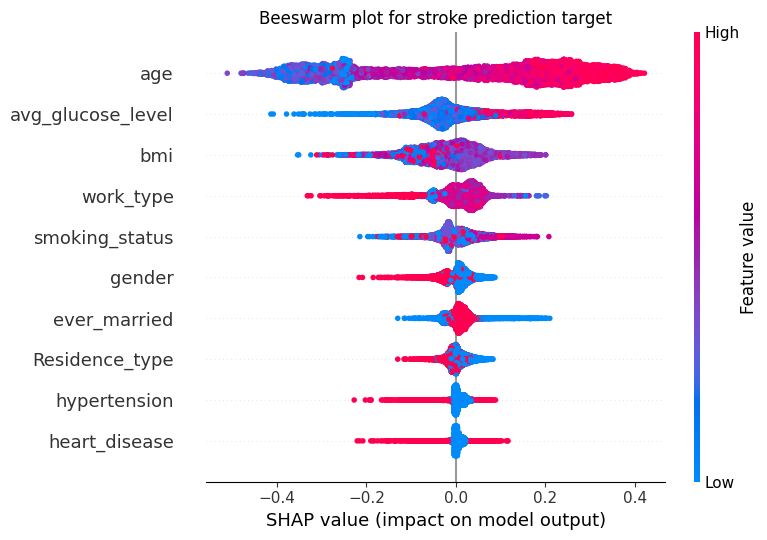

# Stroke Prediction

1. [Introduction](#introduzione)
2. [Dataset](#sezione-1)
    - [Kaggle](#sottosezione-11)
    - [Description](#sottosezione-12)
3. [Methods](#sezione-2)
    - [Exploratory Data Analysis](#sottosezione-21)
    - [Machine Learning models](#sottosezione-22)
    - [eXplainable Artificial Intelligence](#sottosezione-23)
4. [Results](#sezione-3)
    - [ML prediction](#sottosezione-31)
    - [SHAP analysis](#sottosezione-32)
5. [Conclusions](#sezione-4)
6. [References](#sezione-5)

## Introduction

Stroke is a brain attack. It occurs when either blood flow is obstructed in a brain region (ischemic stroke) or sudden bleeding in the brain (hemorrhagic stroke). The effects can lead to brain damage with loss of vision, speech, paralysis and, in many cases, death. 
According to the World Health Organization (WHO)[[1](#ref1)], annually, 15 million people worldwide suffer a stroke. 5 million die and another 5 million are left permanently disabled. An important information also for this project is that stroke can occur in about 8% of children.
In [[2](#ref2)], the World Stroke Organization (WSO) states that stroke continues to be the second-leading cause of death and the third-leading cause of death and disability combined in the world. 
[[3](#ref3)] have made a systematic analysis about global, regional, and national burden of disorders affecting the nervous system and have found that, among 37 conditions affecting the nervous system, stroke is the leading group cause of Disability-adjusted life-years (DALYs) in 2021 for both adults aged 20–59 years, adults aged 60–79 years and adults aged 80 years and older.

This project aims to leverage machine learning and explainability techniques to predict whether a patient is likely to get stroke based on various demographic, lifestyle, and health-related factors.

## Dataset

### Kaggle

The dataset used for this project comes from Kaggle at this link [[4](#ref4)] and it is stored in [raw_data](/raw_data). 

### Description

This dataset is a csv file and it contains 5110 rows and 12 columns, which are:
- id: unique identifier
- gender: "Male", "Female" or "Other"
- age: age of the patient
- hypertension: 0 if the patient doesn't have hypertension, 1 if the patient has hypertension
- heart_disease: 0 if the patient doesn't have any heart diseases, 1 if the patient has a heart disease
- ever_married: "No" or "Yes"
- work_type: "children", "Govt_jov", "Never_worked", "Private" or "Self-employed"
- Residence_type: "Rural" or "Urban"
- avg_glucose_level: average glucose level in blood
- bmi: body mass index
- smoking_status: "formerly smoked", "never smoked", "smokes" or "Unknown"*
- stroke: 1 if the patient had a stroke or 0 if not

## Methods

### Exploratory Data Analysis

Exploratory data analysis (EDA) techniques were employed to gain insights into dataset information and data visualization. In [eda.ipynb](/eda.ipynb), you could find:
- how I managed NaN values with KNN imputation because of the “Missing Completely at Random” (MCAR) or “Missing at Random” (MAR) patterns.
- the outliers detection and removal using several techniques and choosign the best one (for this case): the percentile method with 0.001 and 0.999.
- the feature correlation heatmap with Pearson's correlation score.
- Standardization for continuous numerical features and Encoding phase for categorical features.

### Machine Learning models

In [prediction.ipynb](/prediction.ipynb), I showed you how:
- I handled the dataset unbalanced for the target (stroke) using SMOTE.
- I trained several machine learning models with default parameters (logistic regression, decision tree, random forest, gradient boosting, support vector machine, k-nearest neighbors, and naive Bayes) in a iterated 10-folds cross-validation in order to get robust and reliable results on train and test sets.
- I evaluated the results according to some metrics: accuracy, precision, recall, f1 score, confusion matrix, auc and roc curve.

There are also some appendix to see what happens for hyperparameters tuning (no significant changes in test performances, the dafault choice was the best one) and feature importance with Random Forest (best classifier found after analysis) and Gini Index.

### eXplainable Artificial Intelligence

In order to increase transparency and interpretability to my project, I decided to implement the SHAP (SHapley Additive exPlanations) algorithm with Random Forest, that was the classifier with the best performances. This new module was used to interpret both the feature importance and features' impact on stroke prediction, understanding the underlying factors contributing for the machine learning decision-making process. This section is extremely useful to understand the enormous advantage to get the feature importance with Shapley values: they can show you both global and local explanations, they show the feature importance with the addition of feature values distribution and how they impact on the model prediction.
In [SHAP.ipynb](/SHAP.ipynb), you could find:
- SHAP implemented in a 10-folds CV without iterations with a final and discussed global explanation, and with a local explanation to show how a feature importance for a single instance could change respect to the global one.
- SHAP implemented in a 10-folds CV iterated 5 times, showing global and local explanations with the average Shapley values.
- An appendix with other possible plots that the SHAP algorithm could offer.

## Results

### ML prediction

In this subsection, I will show you the results I obtained using Random Forest (the most performative classifier), but you could find and visualize all the results (mean and std values for every classifier, and for each iteration in the cross-validation) in [prediction.ipynb](/prediction.ipynb).

Evaluation metrics for the test sets:

|                      | Random Forest             |
|----------------------|---------------------------|
|                      |  **Mean ± Std**      |
| Accuracy             | 0.94 ± 0.01          |
| Precision            | 0.91 ± 0.01          |
| Recall               | 0.97 ± 0.01          |
| F1 Score             | 0.94 ± 0.01          |
| AUC                  | 0.94 ± 0.01          |

### SHAP analysis

In this subsection, I will show you the results I obtained using the SHAP algorithm. As you can see in [SHAP.ipynb](/SHAP.ipynb), the features are ordered in the same way with both RF feature importance and SHAP feature importance. The main advantage is to visualize how these features impact the model's stroke prediction and how their values are distirbuted. 
For example, the higher values for age impact the decision-making of the model towards the stroke prediction and for high average glucose level the model tends to predict the patients with stroke and it has a greater impact respect to the lower values. It is clear that smoking patients have a greater impact on the stroke prediction model, as might be expected. The gender distribution is interesting and shows how female patients have a greater impact.
Despite these useful results, I would have expected to find the features of hypertension and hearth_disease.

## Conclusions

The project aimed to train a machine learning model capable of predicting whether a patient is likely to get stroke. The results obtained are extremely satisfactory and highlight how the performances achieved by various classifiers are very high (>94% on the test set). These results are not only excellent in terms of accuracy, but also by observing the average values of precision, recall and auc you can see how the models maintain stable performance. The iterated cross-validation technique made it possible to make the model highly robust. The explainability with SHAP algorithm provided interesting insights into how the random forest used features for stroke prediction both globally and locally.

## References

1.  https://www.emro.who.int/health-topics/stroke-cerebrovascular-accident/index.html
2.  https://pubmed.ncbi.nlm.nih.gov/34986727/
3.  https://www.thelancet.com/journals/laneur/article/PIIS1474-4422(24)00038-3/fulltext
4.  https://www.kaggle.com/datasets/fedesoriano/stroke-prediction-dataset/data

